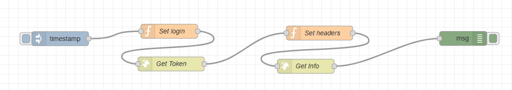

# NodeRed flow to get data from ThingsBoard

This is a small example of how to get http data from thingsboard.

### Note: this fow is using the full user authentication witch may not be the most secure aproach. However the flow can be simplefied to directly user the device token from thingsboard.
